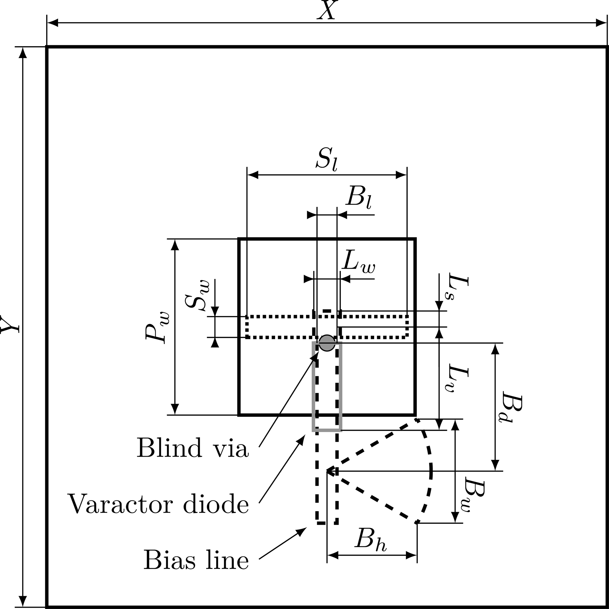
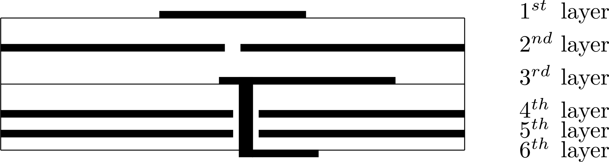
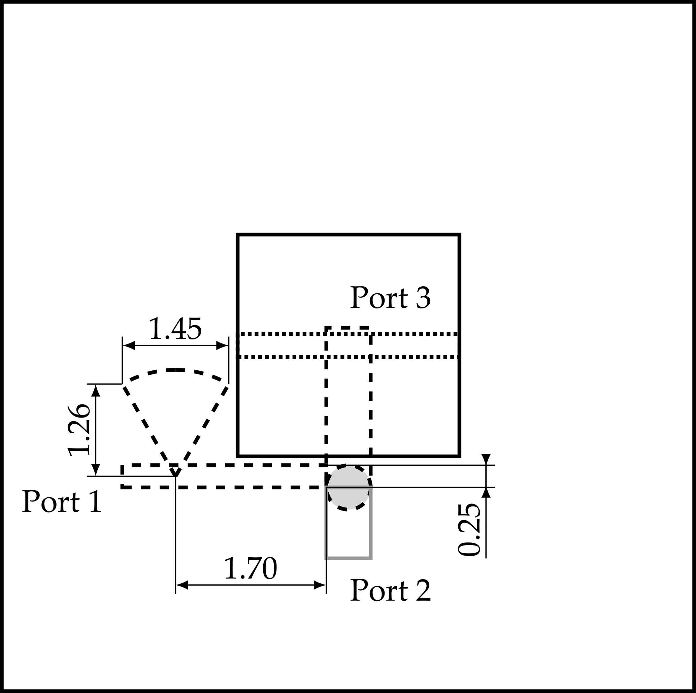

# CST Reconstruction and Electromagnetic Investigation of a Varactor-Tunable 26 GHz Reflectarray Unit Cell

*Working engineering draft*

> This file is generated by `tools/report_build/build_markdown.py`.
> Edit `tools/report_build/report_content.py` and rebuild. The documents
> intended for readers are the DOCX and PDF in `deliverables/`.

- **Author:** Abdulrahman Ahmad
- **Programme:** Electrical and Computer Engineering
- **University:** Constructor University
- **Supervisor:** [to be completed]
- **Module:** [to be completed]
- **Date:** [to be completed]

## Abstract

*Abstract to be completed following final electromagnetic characterisation.*

This is a working engineering document describing an investigation that is still in progress. The abstract, the discussion and the conclusion will be written after the primary electromagnetic characterisation is complete. Section 10 records the interim status.

## 1  Introduction

A reflectarray replaces the shaped surface of a conventional reflector antenna with a flat panel carrying many individually controlled scattering elements. Each element receives the field radiated by a feed antenna and re-radiates it with a prescribed phase, so that the collection of element phases synthesises the wavefront a curved reflector would have produced [1]. Because no corporate feed network distributes the signal to the elements, the arrangement avoids the distribution loss that limits conventional arrays at millimetre wavelengths, while keeping a flat geometry that can be manufactured on ordinary printed circuit board.

When the phase of each element is fixed at manufacture, the beam direction is fixed with it. Making the element phase electronically adjustable turns the same panel into a steerable antenna. Reverse-biased varactor diodes are one of the few practical ways to do this in the K-band: they are small enough to fit behind a single element, they draw negligible current, and their capacitance varies continuously with the applied voltage rather than in discrete steps. Continuous control matters because quantised phase, even at one or two bits, raises sidelobe levels and costs gain at boresight [2].

Interest in this frequency range is driven by 5G deployment near 26 GHz and by the measurement problem that follows from it. Characterising steerable millimetre-wave antennas requires reference antennas whose beam can itself be moved in a known way, which is the application that motivated the reference design used here [3].

Placing a tuning element behind a reflecting surface is not free. The varactor must be reachable by a DC bias network that does not disturb the radio-frequency path, and that path must couple strongly enough into the tuned resonator for the varactor to control the reflected phase. The reference design solves both with an aperture-coupled patch over a buried resonant stripline, a blind via, and a bias-T built from a quarter-wavelength transformer and a radial stub.

The objective of this work is to reconstruct that element in CST Studio Suite from the published description, to establish a full-wave periodic unit-cell model whose configuration and numerical behaviour can be defended, and to investigate how its reflection response depends on the varactor capacitance near 26 GHz. The geometric reconstruction and the initial numerical model have been established, and the model solves reliably. The capacitance-dependent phase behaviour reported by the source has not yet been recovered, and locating it is the current focus of the investigation.

## 2  Reference design

The element reconstructed in this work is the antenna element of Harz and Kleine-Ostmann [3], which develops an earlier element by Harz, Kleine-Ostmann and Schrader [2] and applies the single-varactor concept of Venneri, Costanzo and Di Massa [4]. The two Harz papers describe different elements and their numerical dimensions must not be mixed: the 2020 element uses an 8 mm cell on a Rogers RT5870 substrate, whereas the 2022 element uses a 7 mm cell on Isola Astra MT77. This work reconstructs the 2022 element. The 2020 paper is used for its account of the operating principle and for its dimensioned bias-T figure, which is reproduced in Appendix D.

### 2.1  Operating principle

An incident plane wave illuminates a square patch on the first conductor layer. The patch is not a resonator terminated in free space; it is aperture-coupled through a rectangular slot in the second layer to a stripline on the third layer. Energy therefore passes from the incident field into the patch, through the aperture, and onto the buried stripline, where it encounters the tuning element.

The stripline is divided by its connection point into two lengths that play different roles. The short stub of length Ls above the junction presents an inductive reactance, and the longer section of length Lv below the junction, terminated by the varactor, presents the capacitive part. Together they form a series resonant circuit whose resonant frequency is set principally by Ls and whose usable phase range is matched to the capacitance range of the diode by choosing Lv [3], [4]. Changing the varactor capacitance moves the resonance, and the phase of the wave returned through the aperture to the patch shifts with it. The patch re-radiates that phase-shifted wave, so the reflection phase of the whole cell becomes a function of the bias voltage.

The arrangement has a second benefit that motivated its selection. The 2020 precursor states that every active and biasing component sits behind the ground layer, so that the reflecting face stays flat and the backscatter depends only on the patch and the slot, with no parasitic radiation from the bias circuitry [2]. That is a statement about the precursor element. The 2022 source assigns no conductor layer to the bias-T of the element reconstructed here, so how far the property carries over is open; Section 3.4 records the position taken.

### 2.2  Published element geometry

Figure 1 reproduces the published layout. It fixes the unit-cell extent, the patch and aperture dimensions, the two resonant stripline lengths, and the position of the blind via and the varactor, together with the four dimensions that define the bias-T. The numerical values are collected in Table 1 of [3] and are carried into Table 1 of this report.

**Figure 1.** Published layout of the reference antenna element, showing the unit-cell extent X and Y, the patch width Pw, the coupling slot Sw and Sl, the stripline width Lw and its two resonant lengths Lv and Ls, the blind via, the varactor diode position, and the bias line with the radial stub dimensioned by Bl, Bd, Bw and Bh. Reproduced from Harz and Kleine-Ostmann [3], Fig. 1, under the Creative Commons Attribution 4.0 licence.

Two features of the layout govern the reconstruction. The blind via sits at the junction between Ls and Lv, on the stripline axis, so that the via position and the two published lengths are not independent quantities. The bias line continues away from the patch along that axis, and the radial stub branches laterally from it at a distance Bd from the junction rather than continuing along it. Both readings were taken from the figure directly and both differ from earlier interpretations used in this project.

### 2.3  Published multilayer architecture

The element is built on a six-layer board, reproduced in Figure 2. The first four layers produce the reflection with the intended phase shift; the last two route the bias signals and carry the diode [3].

**Figure 2.** Published six-layer structure of the reference antenna element. The patch sits on layer one, the coupling aperture is the gap in the layer-two conductor, the resonant stripline is on layer three, layer four is the ground plane, and the blind via carries the resonant path down to the varactor on layer six. Reproduced from Harz and Kleine-Ostmann [3], Fig. 2, under the Creative Commons Attribution 4.0 licence.

Layer one carries the patch. Layer two is a conductor sheet interrupted by the coupling aperture, which also serves as the upper ground of the stripline. Layer three carries the resonant stripline and, in this reconstruction, the bias-T branch; Section 3.4 explains why that placement is an interpretation rather than a published assignment. Layer four is the ground plane, which limits radiation from the back of the element. Layers five and six route the control voltage through the array to neighbouring cells and carry the varactor itself. A blind via connects the layer-three resonant path down to the diode, passing through a clearance in the ground plane.

Isola Astra MT77 was chosen for every layer because it supports buried and blind vias and because one material throughout avoids the mechanical stress that would bow a mixed-material board [3]. Its published permittivity of 3.0 and loss factor of 0.0017 are specified only to 20 GHz, and the source applies them at 26 GHz. This reconstruction follows that choice, so the extrapolation is inherited rather than introduced here.

The source does not publish everything the model needs. It gives no via diameter, no ground clearance diameter, no PCB land pattern for the diode, and no dimensions for the layer-five to layer-six interconnect. Section 4.3 records the values adopted in their place.

### 2.4  Published target behaviour

The quantities in this subsection describe the published system. None of them is a result of the model presented in this report, and no result in Section 7 should be read as reproducing them.

The optimisation goal in [3] was a wide phase-shift range, and the reported outcome is a maximum simulated phase shift of 337 degrees for the element whose dimensions appear in Table 1 of that paper. The precursor element of [2] reports 340 degrees for its own, different geometry.

Fabricated elements were then measured in a waveguide simulator, a technique in which a small number of elements placed in a waveguide reproduces the mutual coupling environment of a large array [5]. The control voltage was swept from 0 to 15 V over 25.6 to 26.6 GHz. Within a 100 MHz bandwidth the maximum measured phase-change range lies between 308 and 336 degrees, and at 26.104 GHz specifically it is 322 degrees [3]. The waveguide simulator imposes a tilted incidence of 21.4 degrees, so these measured figures are not directly comparable with normal-incidence unit-cell simulation.

The reference frequency and the frequency interval used throughout this project are inherited from that measurement rather than chosen independently: 26.104 GHz is the frequency at which the source quotes its phase-change range, and 25.6 to 26.6 GHz is the band over which the source measured.

The tuning element is a MACOM flip-chip varactor with a capacitance range of 0.025 to 0.19 pF over a 0 to 15 V control range, for which the manufacturer supplies no equivalent-circuit parameters [3]. The two papers print different part strings for it, an ambiguity recorded in Appendix F.

## 3  CST reconstruction of the unit cell

### 3.1  Reconstruction approach

The model was rebuilt from the published description rather than adapted from an existing project file, so every dimension in it can be traced to a source value, to a derivation from source values, or to a recorded assumption. Each of the three categories is marked as such in Section 4, and no assumed value is presented as a published one.

The geometry is fully parameterised. Layer positions are a chain of z-coordinate formulas driven by the substrate and conductor thicknesses, so changing one thickness moves every layer consistently, and features that must stay aligned are tied to shared parameters rather than to typed coordinates. The geometry variations in Section 7.3 were therefore applied by editing a single parameter, which keeps the rest of the structure self-consistent and makes each variant reproducible from its parameter list.

The element is modelled as one cell of an infinite periodic array rather than in isolation, matching the unit-cell configuration in which the source optimised its own element.

### 3.2  Reconstructed model

Figure 3 shows the reconstructed unit cell. The cell is 7 mm square in the transverse plane, contains six conductor layers separated by five substrates, and is bounded above and below by open space through which the Floquet excitation enters and leaves.

> **FIGURE 3. Figure required, not yet available.**
>
> Isometric view of the reconstructed unit cell in CST Studio Suite 2023, with the substrate stack shown semi-transparent so that all six conductor layers, the blind via and the varactor terminal pads are visible. Capture from the current geometry checkpoint (lineV = 1.13 mm, slotW = 0.35 mm, slotL = 2.32 mm).

**Figure 3.** Reconstructed unit cell in CST Studio Suite 2023. The model is a 7 mm by 7 mm periodic cell containing six perfect-electric-conductor layers separated by five Astra MT77 substrates, with an ideal lumped capacitor across the layer-six terminal pads representing the varactor.

### 3.3  Layer-by-layer model

Figure 4 separates the six conductor layers so that the reconstruction can be compared directly against the published layout of Figure 1.

> **FIGURE 4. Figure required, not yet available.**
>
> Layer-by-layer or exploded composite view of the reconstruction, one panel per conductor layer L1 to L6, all at the same scale and camera orientation, so that the reconstruction can be compared panel by panel against Figure 1. Capture from the same checkpoint as Figure 3.

**Figure 4.** Layer-by-layer view of the reconstruction. L1 carries the square patch, L2 is a conductor sheet interrupted by the rectangular coupling aperture, L3 carries the resonant stripline together with the bias-T branch and radial stub, L4 is the ground plane with a circular clearance around the blind via, L5 carries the DC supply trace, and L6 carries the varactor terminal pads.

The layer-two conductor is built from four rectangular solids rather than as a sheet with a cut, leaving a rectangular aperture of width slotW and length slotL between them. Layer three carries a single stripline solid spanning from -lineV to +lineS in y, so that the blind via at the origin divides it into exactly the two published lengths. Layer four is a full ground plane with a circular clearance centred on the via. Layers five and six carry the DC supply trace and the varactor terminal pads respectively.

### 3.4  Radio-frequency and bias paths

The radio-frequency path runs from the patch, through the aperture, along the layer-three stripline, down the blind via, and onto the layer-six pad pair that carries the varactor. The via passes through the ground-plane clearance without touching it, so the resonant path reaches the diode without shorting to ground.

The bias path is modelled as a branch leaving the same layer-three junction. The quarter-wavelength transformer and the radial stub together present an open circuit at the junction at the operating frequency, which is what keeps the DC feed from loading the resonator; the source reports 36 dB of decoupling for this arrangement [3]. The DC side then continues to the layer-five supply trace through a local interlayer via and reaches the isolated DC pad on layer six.

The layer on which the bias-T sits is a reconstruction interpretation rather than a published assignment. The 2022 source describes the bias-T as a quarter-wavelength stripline transformer with a microstrip radial-stub shunt, and draws the bias line and the radial stub in the same superimposed plan view as the stripline, but neither its text nor its layer-structure figure gives the bias-T a conductor-layer number [3]. The precursor paper is explicit in one direction and contrary in another: its layer-stack figure labels layer three as stripline and bias-T, while its text places the varactor diode and the bias-T behind the ground layer [2]. That stack belongs to the 8 mm precursor element, so it constrains the present reconstruction only by analogy.

The reconstruction places the bias-T branch at the layer-three radio-frequency junction, following the adopted reading of the published plan view. That placement is retained as an interpretation rather than treated as a published dimension. Neither source dimensions the interlayer route between layers three, five and six, so what is modelled there satisfies the published constraints without being a published layout. Appendix F records both points as open.

## 4  Design parameters

This section gives the parameters needed to understand the model. The complete named-parameter inventory, including derived coordinates, is in Appendix A.

### 4.1  Principal parameters

Table 1 lists the principal geometry and excitation parameters together with their published counterparts. The baseline reconstruction implements all dimensions explicitly published for the 2022 reference element. The varactor pad dimensions are omitted here and given with the other assumed quantities in Table 3.

**Table 1.** Principal design parameters of the reconstruction. Published values are taken from Table 1 of [3] and verified directly against the publisher PDF. Where the current model deviates from the published value, both are shown.

| Parameter | Description | Published | Current CST | Unit | Origin and status |
|---|---|---|---|---|---|
| cellX | Unit-cell extent, x | 7.0 | 7.0 | mm | Published (X) |
| cellY | Unit-cell extent, y | 7.0 | 7.0 | mm | Published (Y) |
| patchW | Square patch side, L1 | 2.225 | 2.225 | mm | Published (Pw) |
| slotW | Coupling aperture width, L2 | 0.26 | 0.35 | mm | Published (Sw); current diagnostic value |
| slotL | Coupling aperture length, L2 | 2.275 | 2.32 | mm | Published (Sl); current diagnostic value |
| lineW | Stripline width, L3 | 0.33 | 0.33 | mm | Published (Lw) |
| lineV | Resonant length below the junction | 1.11 | 1.13 | mm | Published (Lv); current diagnostic value |
| lineS | Inductive stub above the junction | 0.20 | 0.20 | mm | Published (Ls) |
| Bl | Bias-line width | 0.25 | 0.25 | mm | Published |
| Bd | Junction to radial-stub offset | 1.6 | 1.6 | mm | Published |
| Bw | Radial-stub half-span | 1.3 | 1.3 | mm | Published |
| Bh | Radial-stub chord offset | 1.13 | 1.13 | mm | Published |
| viaD | Blind-via diameter | not published | 0.20 | mm | Assumed |
| viaClearD | L4 clearance diameter | not published | 0.50 | mm | Assumed |
| Cmin | Lower capacitance endpoint | 0.025 | 0.025 | pF | Published device range |
| Cmax | Upper capacitance endpoint | 0.19 | 0.19 | pF | Published device range |
| fRef | Reference frequency | 26.104 | 26.104 | GHz | Published measurement frequency |

The current diagnostic checkpoint intentionally departs from the published values of slotW, slotL and lineV. These are temporary investigation settings, described with their outcome in Section 7.3, and they are not presented as optimised dimensions.

### 4.2  Stack and material parameters

Table 2 collects the layer stack and material definition. The substrate thicknesses and the material properties are published; the conductor thicknesses are inferred from the source stack description rather than stated by it.

**Table 2.** Layer stack and material definition of the reconstruction.

| Item | Value | Origin |
|---|---|---|
| Substrate material | Isola Astra MT77 | Published [3] |
| Relative permittivity | 3.0 | Published [3], specified to 20 GHz |
| Electric loss tangent | 0.0017 | Published [3], specified to 20 GHz |
| Material reference frequency | 26.104 GHz | Model setting |
| Material fit range | 25.6 to 26.6 GHz | Model setting |
| Substrates 1 to 3 thickness | 0.254 mm each | Published [3] |
| Substrates 4 and 5 thickness | 0.127 mm each | Published [3] |
| Conductor model | Perfect electric conductor | Modelling simplification |
| Upper conductor thickness cuOuter | 0.035 mm | Inferred from the source stack |
| Inner conductor thickness cuInner | 0.018 mm | Inferred from the source stack |
| L5 and L6 conductor thickness | 0.035 mm | Assumed, carried over from cuOuter |

### 4.3  Reconstruction assumptions

Table 3 lists the quantities the model requires but the source does not publish. These quantities are potential contributors to differences between the reconstruction and the published element, and their influence has not yet been sensitivity-tested.

**Table 3.** Reconstruction assumptions. None of these values is published by the source and none has yet been sensitivity-tested.

| Quantity | Value used | Basis |
|---|---|---|
| Blind-via diameter | 0.20 mm | Chosen. No published value in the reviewed material. |
| L4 clearance diameter | 0.50 mm | Chosen to clear the via without shorting the ground plane. |
| L5 and L6 copper thickness | 0.035 mm | Carried over from the upper-layer interpretation. |
| Varactor pad geometry | 0.2155 by 0.1905 mm, 0.4185 mm separation | Taken from a MACOM flip-chip package outline recorded as MAVR-011020-1411, in place of an unpublished PCB land pattern. Neither paper names that variant and the outline drawing has not been retrieved, so the correspondence is unproven. See Appendix F, item 1. |
| L5 to L6 DC interconnect | diameter, position and route chosen | The source shows that a DC path exists but does not dimension it. |
| Varactor electrical model | series RLC, R = 0, L = 0 | Deliberate simplification. Package parasitics and the capacitance-versus-bias law are absent. |

## 5  Electromagnetic simulation methodology

### 5.1  Solver configuration

The frequency-domain solver with a tetrahedral mesh was chosen because the structure is resonant, electrically small, and contains fine features such as the aperture and the via clearance that a conformal tetrahedral mesh resolves efficiently. Table 4 records the configuration.

**Table 4.** Solver and excitation configuration. All entries were read from the CST dialogs.

| Setting | Value |
|---|---|
| Software | CST Studio Suite 2023, university Teaching Licence |
| Solver | Frequency domain, general purpose broadband sweep |
| Mesh | Tetrahedral, with adaptive refinement enabled |
| Frequency interval | 25.6 to 26.6 GHz |
| Reference frequency | 26.104 GHz |
| Boundaries, x and y | Unit cell on Xmin, Xmax, Ymin and Ymax |
| Boundaries, z | Open, add space, on Zmin and Zmax |
| Excitation | Floquet port at Zmax |
| Incidence | theta = 0 degrees, phi = 0 degrees (normal) |
| Propagating modes | Two: TE(0,0) and TM(0,0). Higher orders evanescent |
| Monitored term | SZmax(1),Zmax(1), co-polarised reflection |
| Adaptive passes | Minimum 3, maximum 8 |
| Acceptance criterion | Maximum Delta All S-Parameters of approximately 0.01 |

Unit-cell boundaries in x and y place the element in an infinite periodic array, and open boundaries with added space in z allow the incident and reflected waves to leave the computational domain. At normal incidence in a 7 mm cell only the two fundamental Floquet modes propagate across the simulated interval; the first higher order would begin to propagate only near 43 GHz, so the two-mode configuration is valid with a wide margin. All phase comparisons use the co-polarised term SZmax(1),Zmax(1), because the orthogonal term was found to be nearly insensitive to capacitance and therefore carries no tuning information.

### 5.2  Varactor model

The varactor is represented by a series RLC lumped network element placed across the layer-six terminal pads, with the resistance and inductance set to zero and the capacitance driven by the model parameter varC. Its impedance is that of an ideal capacitor,

> Z_C = 1 / (j2πfC)  (1)

so that at 26.1 GHz the two endpoint capacitances of 0.025 and 0.19 pF correspond to reactance magnitudes of approximately 244 and 32 ohm respectively.

This is deliberately an idealisation. Package parasitics, series resistance, lead inductance and the capacitance-versus-bias characteristic of the real diode are absent, and the manufacturer publishes no equivalent circuit from which they could be added [3]. It isolates the effect of capacitance alone, but the model cannot predict the phase-versus-voltage curve of a physical element and represents no loss or resonance contributed by the package.

### 5.3  Adaptive meshing and convergence

Adaptive tetrahedral refinement runs between three and eight passes, refining the mesh where the field solution changes most between passes. The convergence measure is the Maximum Delta All S-Parameters, the largest change in any S-parameter between consecutive passes, and a run is accepted for comparison only when that quantity falls to approximately 0.01 or below. The threshold was tightened to this value after early runs terminated at a looser default and produced results that were not stable enough to compare between capacitance states.

> **FIGURE 5. Figure required, not yet available.**
>
> Export of the CST adaptive-mesh convergence plot, Maximum Delta All S-Parameters against pass number, for one accepted endpoint run on the current geometry. The horizontal axis must read Pass. State in the caption which capacitance state the run belongs to and the final delta value from the solver log rather than from the plot.

**Figure 5.** Representative adaptive tetrahedral mesh convergence for one accepted endpoint run on the current geometry. The horizontal axis is the refinement pass number, not frequency. The acceptance criterion used throughout this project is a final Maximum Delta All S-Parameters of approximately 0.01 or below.

Figure 5 shows a representative convergence record. Frequency-domain results are presented separately in Section 7.

### 5.4  Quantities evaluated

Four groups of quantities are extracted from each run. The reflection phase of SZmax(1),Zmax(1) is the primary result, since the design intent is phase control, and its magnitude is monitored as a consistency check on the energy balance rather than as a design target. The lumped-element voltage and current monitors give the terminal conditions at the varactor, the only direct view of what the tuning element experiences. Field monitors give surface-current and electric-field distributions at selected frequencies, used qualitatively.

## 6  Model verification

Before any electromagnetic result is interpreted, three questions are settled: whether the numerical solution has converged, whether the tuning element is actually participating in the solution, and whether the geometry is connected the way it is supposed to be.

### 6.1  Numerical convergence

Runs are classified against the criterion defined in Section 5.3. A run that reaches approximately 0.01 or below is accepted for endpoint comparison; a run that does not is either continued with further refinement or discarded. This classification has been applied consistently, and it has excluded results in practice rather than merely in principle: an early baseline that stopped at approximately 0.0119 and a first low-capacitance endpoint that stopped at approximately 0.0138 were both rejected and re-run before use. Both endpoint runs on the current geometry satisfy the criterion. Appendix C holds the per-branch records.

### 6.2  Lumped-element validation

A converged solution does not by itself show that the lumped element is electrically active. The voltage and current monitors at the varactor terminals provide that check directly: their ratio should match the reactance magnitude of an ideal capacitor at the modelled capacitance. Table 5 gives the comparison.

**Table 5.** Lumped-element validation. Terminal voltage and current were read from the CST lumped-element monitors and converted from the plotted dBV and dBA values; they are therefore screenshot-derived. The ideal column is the reactance magnitude of a lossless capacitor at 26.1 GHz.

| varC | Current | Voltage | Measured |V/I| | Ideal 1/(2*pi*f*C) |
|---|---|---|---|---|
| 0.19 pF | approx. 5.6 mA | approx. 0.184 V | approx. 33 ohm | approx. 32 ohm |
| 0.025 pF | approx. 1.9 mA | approx. 0.46 V | approx. 240 to 245 ohm | approx. 244 ohm |

The agreement is close at both endpoints, and the terminal impedance changes by roughly the expected factor between them. The element is therefore excited by the radio-frequency solution and responds to the capacitance parameter as an ideal capacitor would.

The scope of this conclusion is narrow. It establishes that the lumped element is connected, excited and behaving as specified, not that the resonant structure loading it is correct or that the aperture couples into that structure strongly enough for the varactor to control the reflected phase.

### 6.3  Geometry and connectivity

The model was audited for the connections the topology depends on: that the blind via contacts the layer-three stripline and the layer-six pad, that the ground-plane clearance keeps it isolated from layer four, that the varactor pad gap is not bridged by metal, that the layer-five supply route reaches the isolated DC pad, and that exactly one lumped element is active in the branch. A separate audit confirmed that the layer-three solid is divided by the via into the two published lengths, so that the resonant dimensions in the model are the source's dimensions and not an accidental re-partition of them.

## 7  Current electromagnetic results

This section reports what the model currently produces. It is deliberately short: the investigation is in progress and the results below are a status, not an outcome.

### 7.1  Endpoint reflection phase

Figure 6 overlays the reflection phase at the two capacitance endpoints on the current geometry. Both runs satisfy the convergence criterion of Section 5.3, so the comparison is between two numerically settled solutions rather than between two partially converged ones.

> **FIGURE 6. Figure required, not yet available.**
>
> Overlay of the reflection phase of SZmax(1),Zmax(1) against frequency for varC = 0.025 pF and varC = 0.19 pF on the current geometry over approximately 25.6 to 26.6 GHz, with 26.104 GHz marked. Export the underlying numerical data at the same time so that the separation can be stated in degrees.

**Figure 6.** Reflection phase of the co-polarised term SZmax(1),Zmax(1) at the two capacitance endpoints on the current geometry (lineV = 1.13 mm, slotW = 0.35 mm, slotL = 2.32 mm), over approximately 25.6 to 26.6 GHz. Both runs satisfy the convergence criterion of Section 5.3. The reference frequency 26.104 GHz is marked.

The two curves remain almost coincident across most of the simulated interval, and in particular at the 26.104 GHz reference frequency. Some additional separation is visually apparent toward the upper end of the interval, near 26.5 to 26.6 GHz. The current reconstruction therefore does not yet exhibit meaningful capacitance-dependent reflection-phase separation at the reference frequency.

The separation is not quantified in degrees here. The observation is a reading from overlaid plots, and the underlying S-parameter data have not been exported numerically; Section 9 gives that as an immediate task.

### 7.2  Endpoint reflection magnitude

The reflection magnitude stays close to 0 dB across the interval in every converged branch, and the two endpoint curves differ by a few hundredths of a decibel. That is expected of perfect conductors on a low-loss substrate and serves only as a check that no unintended loss mechanism has entered the model. A low-loss resonant element can shift phase strongly while its reflection magnitude stays near unity, so the magnitude carries no evidence either way about a resonance. The overlay is Figure E.1.

### 7.3  Preliminary geometry diagnostics

Single-parameter adjustments to the slot width, the resonant stripline length and the slot length were tried in sequence to see whether a nearby geometry would recover endpoint phase separation at the reference frequency. None did. Table 6 summarises them.

**Table 6.** Single-parameter geometry adjustments carried out as diagnostic checks. Each value was applied in sequence and carried forward, so the three were not varied independently about a common baseline.

| Parameter | Reference value | Diagnostic value | Outcome at 26.104 GHz |
|---|---|---|---|
| slotW | 0.26 mm | 0.35 mm | No meaningful endpoint phase separation recovered |
| lineV | 1.11 mm | 1.13 mm | No meaningful endpoint phase separation recovered |
| slotL | 2.275 mm | 2.32 mm | No meaningful endpoint phase separation recovered |

Only isolated nearby values were tested, and each change was carried forward into the next rather than applied about a common baseline, so these trials are diagnostic checks rather than a parametric sensitivity study. They neither establish that these dimensions are unimportant nor bound the response over any wider parameter range. The record of each branch is in Appendix D and in the repository experiment log.

### 7.4  Surface-current distribution

A field monitor at the reference frequency was used to see where current concentrates in the structure. Figure 7 shows the surface-current magnitude for the low-capacitance state.

> **FIGURE 7. Figure required, not yet available.**
>
> Surface-current magnitude plot at 26.104 GHz from the field-audit run at varC = 0.025 pF, rescaled to a fixed 0 to 5 A/m range so that the layer-three resonant path is visible. Use a camera position that can be repeated for the planned 0.19 pF counterpart.

**Figure 7.** Surface-current magnitude at 26.104 GHz for varC = 0.025 pF, plotted on a fixed 0 to 5 A/m colour scale so that the resonant path is visible. The global maximum reported by the solver for this run is 392.368 A/m, located at approximately (1.138, -0.130, -0.254) mm, which is the layer-two level. The fixed scale saturates the aperture region by construction and the plot is therefore a qualitative distribution, not a calibrated field export.

The solver-reported maximum given in the caption, 392.368 A/m at the layer-two level near the aperture, is the only calibrated value available for this run. On the fixed 0 to 5 A/m display the layer-three resonant path appears at substantially lower current density than the layer-two field concentration. That display is qualitative and supports no numerical ratio between the two.

This observation is not on its own evidence that coupling into the resonator is inadequate. A resonant path can carry modest current and still dominate the reflected phase, and the comparison here is between a current maximum at a field concentration and a distributed current elsewhere in the structure. Interpreting it requires the same monitor at the other capacitance endpoint, which has not yet been run.

## 8  Current engineering status

Four things are established. The baseline reconstruction implements all dimensions explicitly published for the 2022 reference element, and the model solves as a periodic unit-cell model with a defensible solver configuration; the current checkpoint departs from three of those dimensions by design. Accepted runs meet a stated convergence criterion that has excluded results in practice. The lumped varactor is electrically active and responds to the capacitance parameter as an ideal capacitor. On the current geometry, the two capacitance endpoints produce almost coincident reflection-phase curves at the reference frequency.

Three things are unresolved. The frequency region in which this element is most sensitive to capacitance has not been located, and the simulated interval so far has been the one inherited from the source measurement rather than one chosen to find that region. The reconstruction still contains unpublished quantities, listed in Table 3, whose influence has not been bounded. And it is not yet known whether the discrepancy originates in the coupling into the resonator, in the placement of the resonance, in one of those assumed quantities, or in some combination of them.

The diagnostic branches carried out so far have not localised the discrepancy. Each rejects one hypothesis about the topology or one nearby geometry; none establishes that the feature it changed is electrically unimportant, and none has been tested outside the original 1 GHz interval.

## 9  Ongoing work

The immediate task is a wider-frequency endpoint diagnostic on the unchanged current geometry, run at both capacitance endpoints. Widening the sweep before changing the geometry again keeps the comparison against the existing result clean, and it directly addresses the possibility that the capacitance-sensitive region lies outside the interval examined so far. The new bounds have not been selected. Extending the interval also requires re-checking the material fit range, which is currently declared over 25.6 to 26.6 GHz, and the published material specification itself is quoted only to 20 GHz.

Alongside that, the S-parameter results will be exported numerically rather than read from plots, so that endpoint separation can be stated in degrees and tracked between branches instead of being described qualitatively.

Further work depends on what those two steps show. If a capacitance-sensitive region is found, the sequence is to characterise it, then to move it toward 26.104 GHz by targeted geometry changes, and only then to run a dense capacitance sweep. If no such region is found, the assumed quantities in Table 3 become the next candidates, starting with a sensitivity test of the via and clearance diameters and a field-monitor comparison between the two capacitance states on the same geometry.

None of the work in this section has been carried out. Nothing in this report establishes that a resonance exists above the present upper simulation boundary.

## 10  Interim project status

A parameterised six-layer reconstruction of the published element now exists in CST. Its baseline implements all dimensions explicitly published for the 2022 element, and the current diagnostic checkpoint departs from three of them by design. The solver configuration, the convergence behaviour and the internal connectivity have been checked, and the lumped varactor has been verified to be electrically active at both capacitance endpoints.

The behaviour that motivated the work has not been recovered. On the geometry tested so far, changing the varactor capacitance across its full range leaves the reflection phase at 26.104 GHz essentially unchanged, whereas the source reports a simulated phase shift of 337 degrees for its element and a measured phase-change range of 322 degrees at that frequency. Explaining that difference is the open problem, and this report does not claim to have reproduced the published behaviour. No hardware has been fabricated or measured in this project; every result reported here is from simulation.

The next step is the wider-frequency diagnostic described in Section 9, followed by numerical export of the endpoint data. This document is a working engineering report and will be revised as that work produces results. When the investigation reaches a conclusion, this section will be replaced by a proper discussion and conclusion, and the abstract will be written then.

## References

1. J. Huang and J. A. Encinar, Reflectarray Antennas, M. E. El-Hawary, Ed. New York, NY, USA: Wiley-IEEE Press, 2008, doi: 10.1002/9780470178775.
2. T. Harz, T. Kleine-Ostmann, and T. Schrader, “Design of a continuously tunable reflectarray element for 5G metrology in the k-band,” Advances in Radio Science, vol. 18, pp. 1–5, 2020, doi: 10.5194/ars-18-1-2020.
3. T. Harz and T. Kleine-Ostmann, “Measurement and optimization of a continuously tunable 10 x 10 reflectarray antenna for 5G metrology in the K-band,” Advances in Radio Science, vol. 19, pp. 215–220, 2022, doi: 10.5194/ars-19-215-2022.
4. F. Venneri, S. Costanzo, and G. Di Massa, “Design and validation of a reconfigurable single varactor-tuned reflectarray,” IEEE Transactions on Antennas and Propagation, vol. 61, pp. 635–645, 2013, doi: 10.1109/TAP.2012.2226229.
5. P. Hannan and M. Balfour, “Simulation of a phased-array antenna in waveguide,” IEEE Transactions on Antennas and Propagation, vol. 13, 1965, doi: 10.1109/TAP.1965.1138428.
6. Dassault Systèmes, CST Studio Suite 2023. [Computer software]. [TO BE COMPLETED: confirm the vendor string, release designation and build number from Help > About in the installed copy before submission.]
7. MACOM Technology Solutions, MAVR-011020 series flip-chip varactor diode datasheet. [TO BE COMPLETED: the correct part variant is unresolved, see Appendix F, item 1. Add the datasheet revision and access date once the variant is fixed.]

References [2] and [3] are the source papers and were read in full. Entries [1], [4] and [5] were transcribed from the reference lists of those papers; no page range is given for [5] because the list that cites it prints an implausible one. References [6] and [7] are deliberately incomplete rather than filled in from memory.

## Appendix A  CST parameter inventory

This appendix lists every named parameter the model records, divided by how far each one can be tied to the present reconstruction. Section A.1 holds the parameters believed to belong to the current model, and Section A.2 holds entries that the development record preserves but that the present evidence cannot place in it. Nothing is discarded between the two.

Neither table is an export. No CST parameter export is available on the machine used to prepare this report, so the inventory is assembled from the project model records. A direct export from the live model is still needed before Table A.1 can be treated as an authoritative statement of what the model contains.

### A.1  Current reconstructed-model parameter inventory

The baseline column and the current column are given separately, so that a value produced at the reconstruction baseline is never shown as though it were the value at the present checkpoint. For a parameter that does not depend on a displaced dimension the two columns are identical.

Three parameters are displaced from their published values at the current checkpoint: slotW, slotL and lineV. Every expression that depends on lineV re-evaluates with it, and the current column for those entries is computed from the recorded expression rather than read back from the solver. The origin column marks them accordingly. The substrate permittivity is not listed here because its parameter spelling is disputed; the entry is in Table A.2 and the value it carries, 3, is the published one.

**Table A.1.** Named parameters of the current reconstruction. The baseline column is the reconstruction baseline; the current column is the diagnostic checkpoint at slotW = 0.35 mm, slotL = 2.32 mm and lineV = 1.13 mm. Development-record, superseded and disputed names are held separately in Table A.2.

| Parameter | Definition or expression | Baseline | Current | Unit | Purpose | Origin and status |
|---|---|---|---|---|---|---|
| theta | 0 | 0 | 0 | deg | Incidence elevation angle | Model setting |
| phi | 0 | 0 | 0 | deg | Incidence azimuth angle | Model setting |
| fRef | 26.104 | 26.104 | 26.104 | GHz | Reference and material fit frequency | Published [3] |
| cellX | 7 | 7 | 7 | mm | Unit-cell extent in x | Published (X) [3] |
| cellY | 7 | 7 | 7 | mm | Unit-cell extent in y | Published (Y) [3] |
| patchW | 2.225 | 2.225 | 2.225 | mm | Square patch side on L1 | Published (Pw) [3] |
| slotW | independent | 0.26 | 0.35 | mm | Coupling aperture width on L2 | Published (Sw) [3]; currently displaced |
| slotL | independent | 2.275 | 2.32 | mm | Coupling aperture length on L2 | Published (Sl) [3]; currently displaced |
| lineW | 0.33 | 0.33 | 0.33 | mm | Stripline width on L3 | Published (Lw) [3] |
| lineV | independent | 1.11 | 1.13 | mm | Resonant length below the junction | Published (Lv) [3]; currently displaced |
| lineS | 0.2 | 0.2 | 0.2 | mm | Inductive stub above the junction | Published (Ls) [3] |
| sub1 | 0.254 | 0.254 | 0.254 | mm | Substrate 1 thickness, L1 to L2 | Published [3] |
| sub2 | 0.254 | 0.254 | 0.254 | mm | Substrate 2 thickness, L2 to L3 | Published [3] |
| sub3 | 0.254 | 0.254 | 0.254 | mm | Substrate 3 thickness, L3 to L4 | Published [3] |
| sub4 | 0.127 | 0.127 | 0.127 | mm | Substrate 4 thickness, L4 to L5 | Published [3] |
| sub5 | 0.127 | 0.127 | 0.127 | mm | Substrate 5 thickness, L5 to L6 | Published [3] |
| cuOuter | 0.035 | 0.035 | 0.035 | mm | Outer-layer conductor thickness | Inferred from the source stack |
| cuInner | 0.018 | 0.018 | 0.018 | mm | Inner-layer conductor thickness | Inferred from the source stack |
| tanDAstra | 0.0017 | 0.0017 | 0.0017 | - | Substrate electric loss tangent | Published [3] |
| biasW | 0.25 | 0.25 | 0.25 | mm | Bias-line width; published symbol Bl | Published [3]; CST name from the model record |
| Bd | 1.6 | 1.6 | 1.6 | mm | Junction to radial-stub offset | Published [3] |
| Bw | 1.3 | 1.3 | 1.3 | mm | Radial-stub half-span | Published [3] |
| Bh | 1.13 | 1.13 | 1.13 | mm | Radial-stub chord offset | Published [3] |
| zPatchBottom | 0 | 0 | 0 | mm | L1 lower face, stack datum | Derived |
| zPatchTop | zPatchBottom + cuOuter | 0.035 | 0.035 | mm | L1 upper face | Derived |
| zL2Top | -sub1 | -0.254 | -0.254 | mm | L2 upper face | Derived |
| zL2Bottom | zL2Top - cuOuter | -0.289 | -0.289 | mm | L2 lower face | Derived |
| zL3Top | zL2Bottom - sub2 | -0.543 | -0.543 | mm | L3 upper face | Derived |
| zL3Bottom | zL3Top - cuInner | -0.561 | -0.561 | mm | L3 lower face | Derived |
| zL4Top | zL3Bottom - sub3 | -0.815 | -0.815 | mm | L4 upper face | Derived |
| zL4Bottom | zL4Top - cuInner | -0.833 | -0.833 | mm | L4 lower face | Derived |
| zL5Top | zL4Bottom - sub4 | -0.960 | -0.960 | mm | L5 upper face | Derived |
| zL5Bottom | zL5Top - cuOuter | -0.995 | -0.995 | mm | L5 lower face | Derived |
| zL6Top | zL5Bottom - sub5 | -1.122 | -1.122 | mm | L6 upper face | Derived |
| zL6Bottom | zL6Top - cuOuter | -1.157 | -1.157 | mm | L6 lower face | Derived |
| viaD | 0.20 | 0.20 | 0.20 | mm | Blind-via diameter | Assumed |
| viaClearD | 0.50 | 0.50 | 0.50 | mm | L4 clearance diameter | Assumed |
| viaX | capX | 0 | 0 | mm | Blind-via centre, x | Derived |
| viaY | 0 | 0 | 0 | mm | Blind-via centre, y; splits L3 into Lv and Ls | Derived, locked |
| viaZtop | zL3Bottom | -0.561 | -0.561 | mm | Blind-via upper end | Derived |
| viaZbottom | zL6Top | -1.122 | -1.122 | mm | Blind-via lower end | Derived |
| capX | 0 | 0 | 0 | mm | Tuning-element centre, x | Derived |
| capY | -lineV + lineW/2 | -0.945 | -0.965 | mm | Tuning-element centre, y | Derived; computed from the expression |
| varCenterY | capY | -0.945 | -0.965 | mm | Varactor terminal-pair centre | Derived; computed from the expression |
| varTermSep | 0.4185 | 0.4185 | 0.4185 | mm | Separation of the two terminal pads | Assumed from a package outline |
| varPadW | 0.2155 | 0.2155 | 0.2155 | mm | Terminal pad width on L6 | Assumed from a package outline |
| varPadL | 0.1905 | 0.1905 | 0.1905 | mm | Terminal pad length on L6 | Assumed from a package outline |
| varRFPadY | varCenterY + varTermSep/2 | -0.73575 | -0.75575 | mm | Radio-frequency-side pad centre | Derived; computed from the expression |
| varDCPadY | varCenterY - varTermSep/2 | -1.15425 | -1.17425 | mm | DC-side pad centre | Derived; computed from the expression |
| varPadXmin | -varPadW/2 | -0.10775 | -0.10775 | mm | Pad extent, x minimum | Derived |
| varPadXmax | +varPadW/2 | +0.10775 | +0.10775 | mm | Pad extent, x maximum | Derived |
| varRFPadYmax | varRFPadY + varPadL/2 | -0.6405 | -0.6605 | mm | Radio-frequency pad extent, y maximum | Derived; computed from the expression |
| varRFPadYmin | varRFPadY - varPadL/2 | -0.831 | -0.851 | mm | Radio-frequency pad extent, y minimum | Derived; computed from the expression |
| varDCPadYmax | varDCPadY + varPadL/2 | -1.059 | -1.079 | mm | DC pad extent, y maximum | Derived; computed from the expression |
| varDCPadYmin | varDCPadY - varPadL/2 | -1.2495 | -1.2695 | mm | DC pad extent, y minimum | Derived; computed from the expression |
| varElemX | 0 | 0 | 0 | mm | Lumped-element position, x | Derived |
| varElemZ | zL6Top | -1.122 | -1.122 | mm | Lumped-element position, z | Derived |
| varElemY_RF | varRFPadYmin | -0.831 | -0.851 | mm | Lumped-element terminal, radio-frequency side | Model record; expression inferred |
| varElemY_DC | varDCPadYmax | -1.059 | -1.079 | mm | Lumped-element terminal, DC side | Model record; expression inferred |
| stubR | Sqr(Bh*Bh + Bw*Bw) | 1.7225 | 1.7225 | mm | Radial-stub sector radius | Derived from published Bh, Bw; agrees with the model record |
| stubHalfAng | atan(Bw/Bh)*180/pi | 48.99 | 48.99 | deg | Radial-stub sector half-angle | Derived from published Bh, Bw; agrees with the model record |
| stubCx | viaX | 0 | 0 | mm | Sector apex, x | Derived |
| stubCy | viaY - Bd | -1.6 | -1.6 | mm | Sector apex, y | Derived; agrees with the model record |
| stubChordX | Bh | 1.13 | 1.13 | mm | Chord offset from the bias-line axis | Derived |
| Cmin | 0.025 | 0.025 | 0.025 | pF | Lower capacitance endpoint | Published device range [3] |
| Cmax | 0.19 | 0.19 | 0.19 | pF | Upper capacitance endpoint | Published device range [3] |
| varC | set per run | 0.10 | 0.025 or 0.19 | pF | Active varactor capacitance | Controlled variable |

### A.2  Development-record, superseded and unverified parameter names

Table A.2 holds the entries that the model records preserve but that cannot be placed in the current model from the evidence available here. They fall into four groups: captures made before the source-topology rebuild described in Appendix D, which moved the bias network; constructions the report records as superseded; names the project records disagree about; and alternative names from the model history that carry no verified value.

Two disagreements are worth naming. The substrate permittivity parameter is written espAstra in the Stage-A parameter table and epsAstra in the later bias-T parameter audit. The stub half-height parameter is captured as 1.3 mm in the audit and as Bw/2 in the earlier construction. Both are flagged rather than silently corrected, and both are settled by the same parameter export that Table A.1 needs.

**Table A.2.** Parameter names the model records preserve that cannot be placed in the current model from the evidence available here. A value given as [VERIFY] carries the flag VERIFY AGAINST CST PARAMETER LIST. The baseline column is the value the record captures; the current column is unconfirmed except where the value is published.

| Parameter | Definition or expression | Recorded | Current | Unit | Purpose | Origin and status |
|---|---|---|---|---|---|---|
| espAstra | 3 | 3 | 3 | - | Substrate relative permittivity | Value published [3]; CST spelling disputed against epsAstra, [VERIFY] |
| biasYTop | 0 | 0 | [VERIFY] | mm | Bias-line extent, y maximum | Model record capture, pre-rebuild topology |
| biasYbottom | -Bd | -1.6 | [VERIFY] | mm | Bias-line extent, y minimum | Model record capture, pre-rebuild topology |
| rfTraceYmax | viaY | 0 | [VERIFY] | mm | L6 radio-frequency trace, y maximum | Model record capture, pre-rebuild topology |
| rfTraceYmin | varRFPadYmax | -0.6405 | [VERIFY] | mm | L6 radio-frequency trace, y minimum | Model record capture, pre-rebuild topology |
| dcTraceYmax | varDCPadYmin | -1.2495 | [VERIFY] | mm | L6 DC trace, y maximum | Model record capture, pre-rebuild topology |
| dcTraceYmin | stubCy | -1.6 | [VERIFY] | mm | L6 DC trace, y minimum | Model record capture, pre-rebuild topology |
| stubHalfH | disputed | 1.3 or 0.65 | [VERIFY] | mm | Stub half-height | One record captures 1.3 mm, another the superseded reading Bw/2 |
| stubEdgeX | Sqr(stubR^2 - stubHalfH^2) | 0.92434 for Bw/2 | [VERIFY] | mm | Superseded chord construction | Superseded, see Appendix D; depends on the disputed stubHalfH |
| stubHalfSpanY | Bw | 1.3 | [VERIFY] | mm | Superseded span definition | Superseded, see Appendix D |
| stubApexX | viaX | Not verified | Not verified | mm | Alternative apex naming in the model history | Not verified in current evidence |
| stubApexY | viaY - Bd | Not verified | Not verified | mm | Alternative apex naming in the model history | Not verified in current evidence |

## Appendix B  Layer stack and derived z coordinates

All z coordinates are derived from the substrate and conductor thicknesses by the chain of expressions in Appendix A, with the lower face of the layer-one patch as the datum. Table B.1 gives the resolved stack.

**Table B.1.** Layer stack of the reconstruction with the derived z coordinates. The datum is the lower face of the layer-one patch.

| Layer | Content | Upper face | Lower face | Thickness |
|---|---|---|---|---|
| L1 | Square patch | +0.035 | 0.000 | 0.035 mm |
| Substrate 1 | Astra MT77 | 0.000 | -0.254 | 0.254 mm |
| L2 | Conductor sheet with the coupling aperture | -0.254 | -0.289 | 0.035 mm |
| Substrate 2 | Astra MT77 | -0.289 | -0.543 | 0.254 mm |
| L3 | Resonant stripline, bias-T branch, radial stub | -0.543 | -0.561 | 0.018 mm |
| Substrate 3 | Astra MT77 | -0.561 | -0.815 | 0.254 mm |
| L4 | Ground plane with the via clearance | -0.815 | -0.833 | 0.018 mm |
| Substrate 4 | Astra MT77 | -0.833 | -0.960 | 0.127 mm |
| L5 | DC supply trace | -0.960 | -0.995 | 0.035 mm |
| Substrate 5 | Astra MT77 | -0.995 | -1.122 | 0.127 mm |
| L6 | Varactor terminal pads and DC pad | -1.122 | -1.157 | 0.035 mm |

## Appendix C  Solver settings and convergence records

The solver configuration is given in Table 4 of the main text and is not repeated here. Table C.1 records the convergence outcome of each simulated branch.

**Table C.1.** Convergence records for the simulated branches. Values marked approx. were read from a convergence plot rather than from a solver log. The acceptance criterion is a final Maximum Delta All S-Parameters of approximately 0.01 or below.

| Branch | Configuration | Final delta | Accepted |
|---|---|---|---|
| Stage A baseline | varC = 0.10 pF | approx. 0.008 | Yes |
| Stage B, first solve | varC = 0.10 pF | approx. 0.0119 at pass 3 | No, re-run |
| Stage B baseline | varC = 0.10 pF | approx. 0.0089 at pass 6 | Yes |
| Stage B endpoint high | varC = 0.19 pF | approx. 0.009 at pass 6 | Yes |
| Stage B endpoint low, first attempt | varC = 0.025 pF | approx. 0.0138 at pass 5 | No, re-run |
| Stage B endpoint low, refined | varC = 0.025 pF | below 0.01 | Yes |
| L3 termination variant | 0.025 / 0.19 pF | approx. 0.0089 / 0.0093 | Yes |
| L5 reference-plane variant | 0.025 / 0.19 pF | approx. 0.0098 to 0.010 / 0.0087 | Yes |
| Source-topology rebuild | 0.025 / 0.19 pF | approx. 0.0094 / 0.007 | Yes |
| Current geometry | 0.025 / 0.19 pF | Both meet the criterion; the two individual values are not in the record | Yes |

Two entries in this table are runs that failed the criterion and were re-run rather than used. They are kept because the acceptance rule is only meaningful if it is shown to have excluded results. Figure C.1 collects the per-branch convergence plots themselves.

> **FIGURE C.1. Figure required, not yet available.**
>
> Per-branch adaptive-convergence plots for the accepted Stage-B and diagnostic branches listed in Table C.1, one panel per branch, all with Pass on the horizontal axis.

**Figure C.1.** Per-branch adaptive-mesh convergence records for the branches in Table C.1.

## Appendix D  Engineering experiment history and rejected diagnostic variants

The main text summarises only what bears on the current engineering position. This appendix records the diagnostic branches themselves. The complete chronological record, including construction checkpoints that were never simulated, is maintained in docs/experiment_log.md in the project repository.

The work divides into two stages. Stage A modelled the four upper layers with a capacitor placed directly between the stripline and the ground plane. Stage B added layers five and six, the blind via and its clearance, the varactor terminal pads and the bias network, and moved the lumped element onto the layer-six terminal pair. All results in the main text are Stage-B results. Table D.1 lists the branches and what each one settled.

**Table D.1.** Diagnostic branches and their outcomes. None of these outcomes establishes that the feature changed is electrically unimportant; each rejects one specific hypothesis under one specific set of conditions.

| Branch | Hypothesis tested | Outcome |
|---|---|---|
| Stage A, simplified stack | A capacitor placed directly between the L3 stripline and the L4 ground reproduces the tuning behaviour | Rejected. Total phase change across the full capacitance range was of the order of a few degrees. Retained as a diagnostic reference branch. |
| L3 termination at the via | Truncating the stripline so that it ends at the blind via recovers tuning | Rejected. Both endpoints converged and the phase curves stayed almost coincident. |
| L5 reference plane | A missing reference plane on L5 prevents the radial stub from behaving as a microstrip structure | Rejected. Separation stayed at approximately 1 to 1.5 degrees at the upper band edge. A later source check found L5 to be a bias-supply layer rather than a ground plane, so the plane was removed on source grounds as well. |
| Bias-T on L6 | The quarter-wave transformer and radial stub belong on L6, in series between the varactor and the DC supply | Set aside before simulation on the adopted reading of the published plan-view topology. That reading is an interpretation rather than a published layer assignment, so this branch is not closed by source evidence. See Appendix F, item 3. |
| Stub dimensioning by Bw/2 | The radial stub has radius Bh and half-height Bw/2 | Superseded by a re-reading of the source figure. The corrected sector uses a radius of Sqr(Bh^2 + Bw^2) and a half-angle of approximately 49 degrees. |
| Stub opening toward -Y | The radial stub continues along the bias line rather than branching from it | Superseded. The source top view shows the stub branching laterally. |
| Via anchored at capY | Moving the blind via to capY restores the resonant loading | Rejected before simulation. Because capY is the varactor terminal-pair centre, the change drove the via into the varactor gap and produced overlapping solids, so no valid geometry existed to simulate. |
| Source-topology rebuild | Rebuilding the bias-T on L3 as a branch, removing the L5 plane and routing the DC side through L5 recovers tuning | Rejected as the missing tuning mechanism; the branch did not recover meaningful tuning and separation stayed at approximately 1 degree near the upper band edge. Elements of the rebuild that are directly source-supported were retained; the layer-three bias-T placement remains the current reconstruction interpretation and is tracked as an unresolved source ambiguity. |
| Geometry diagnostics | A nearby value of slotW, lineV or slotL recovers endpoint separation at the reference frequency | Rejected for the values tested. See Section 7.3. Per-run numerical records for the slotW and lineV branches were not archived. |

The stub orientation entries above were read against the dimensioned bias-T figure of the 2020 precursor paper, reproduced as Figure D.1. That figure was used as supporting evidence for the qualitative bias-T topology and for the lateral orientation of the radial stub, and for nothing else. Its numerical dimensions belong to the 2020 precursor element and were not transferred as dimensions of the 2022 cell reconstructed here.

**Figure D.1.** Bias-T dimensions and port definitions for the 2020 precursor element. The radial stub branches laterally from the bias line rather than continuing along it. The figure was used as supporting evidence for the qualitative bias-T topology and for the lateral orientation of the radial stub. Its numerical dimensions belong to the 2020 precursor element and were not transferred as dimensions of the 2022 cell reconstructed here. Reproduced from Harz et al. [2], Fig. 5, under the Creative Commons Attribution 4.0 licence.

## Appendix E  Additional electromagnetic plots

The plots listed here support the main text but are not needed to follow it. Figure E.1 is the endpoint reflection-magnitude overlay discussed in Section 7.2, and Figure E.2 is the electric-field distribution at the reference frequency. Neither has yet been exported from the solver.

> **FIGURE E.1. Figure required, not yet available.**
>
> Overlay of the reflection magnitude of SZmax(1),Zmax(1) against frequency at varC = 0.025 pF and 0.19 pF on the current geometry, same runs as Figure 6.

**Figure E.1.** Reflection magnitude at the two capacitance endpoints on the current geometry, same runs as Figure 6. Discussed in Section 7.2.

> **FIGURE E.2. Figure required, not yet available.**
>
> Electric-field magnitude at 26.104 GHz on a fixed non-saturating scale, starting near 0 to 10000 V/m, with the same camera position as Figure 7. The existing capture saturates and carries no information, so it must be regenerated before use.

**Figure E.2.** Electric-field magnitude at 26.104 GHz for varC = 0.025 pF on a fixed non-saturating colour scale.

## Appendix F  Unresolved source and reconstruction ambiguities

The following points are unsettled. They are recorded here so that they are not mistaken for settled ones, and each is tracked in docs/claims_ledger.md in the project repository.

1. The exact varactor part variant. Three part strings are in play. The 2022 paper prints MAVR-011020-111 (Sect. 2 of [3]) and the 2020 paper prints MAVR-011020-141 for the same 0.025 to 0.19 pF range over 0 to 15 V (Sect. 4 of [2]); both were read from the publisher PDFs. The outline used for the pad geometry here was recorded as MAVR-011020-1411, the string that appears in the MACOM catalogue and in distributor listings for a flip-chip hyperabrupt varactor specified at 0.025 pF at 15 V. No catalogue entry was found for either string printed in the papers, and the pages carrying the mechanical outline could not be retrieved, so the drawing behind varPadW, varPadL and varTermSep has not been shown to match the part either paper names. Those three dimensions stay an explicit assumption in Table 3, and the CST pad geometry is left unchanged. The project reference index records the outline as Case Style 1500.
2. The incidence angle used in the source's own unit-cell simulation. The source states that the element was optimised in a unit-cell configuration but does not give the angle; this model uses normal incidence. The published measurement used a waveguide simulator at 21.4 degrees, so the measured phase figures quoted in Section 2.4 are not directly comparable with normal-incidence simulation.
3. The conductor layer of the bias-T. The 2022 source gives the bias-T no layer number, in its text or in its layer-structure figure. The Layer-3 placement used here follows the superimposed plan view of that paper and the Layer-3 label in the precursor stack-up, but the precursor describes a different element and its own text places the bias-T behind the ground layer. The placement is an interpretation, and the alternative arrangement recorded in Appendix D is therefore not closed by source evidence.
4. The interlayer bias route between layers three, five and six. The source establishes that the route exists but does not dimension it. What is modelled satisfies the published constraints without being a published layout.
5. The conductor thicknesses. These are inferred from the source stack description rather than published, and the value used for layers five and six is carried over from the upper layers.
6. The substrate properties above 20 GHz. The published permittivity and loss factor are specified only to 20 GHz and are applied here at 26 GHz, following the source. Widening the simulated interval will extend this extrapolation further and requires the material fit range to be re-checked.
7. Per-run numerical records for the slotW and lineV diagnostic branches. Their parameter values are known and carried forward into the current geometry, but their individual convergence and phase readings were not archived. No numerical value from those two branches is quoted anywhere in this report.
8. The endpoint phase separation near the upper band edge. It has been observed from overlaid plots but not quantified, because the S-parameter data have not been exported numerically.
